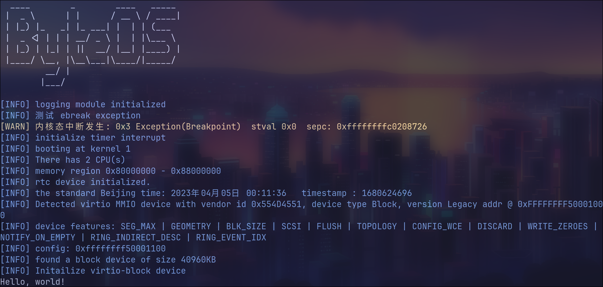

# 河南科技大学-你说对不队

## 内核 ByteOS

## Kernel struct Design

```plain
crates --> arch --> modules --> kernel
```

## TODO List
- [x] higher half kernel
- [x] Modular skeleton
- [x] global allocator
- [x] RTC device support
- [x] Timestamp --> actual Date/Time [timestamp crate](crates/timestamp/)
- [x] frame allocator, use bit_field to store page usage
- [x] Interrupt support
- [x] backtrace support
- [x] timer interrupt support
- [x] page mapping support
- [x] get devices info and memory info from device_tree
- [x] VIRTIO blk device support
- [x] Add a banner for os. use tool [banner生成工具](http://patorjk.com/software/taag/#p=display&f=Big&t=ByteOS)
- [x] vfs support, contains Inode
- [x] fatfs support
- [ ] fs mount support
- [ ] ramfs support
- [ ] devfs support
- [ ] process support
- [ ] syscalls
    - [ ] open
    - [ ] exec
    - [ ] read
    - [ ] write
- [ ] add the large page (addr > 0xffffffffc02x0000) to allocator
- [ ] VIRTIO net device support
- [ ] smp support
- [ ] async/await support

# 运行

```shell
make run
```


